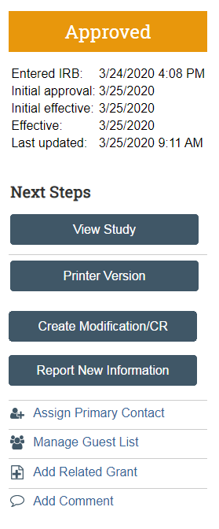

# IRB obligations

## Required updates to the IRB
While research is ongoing, it is the researcher's respnosibility to update the IRB submission and seek approval prior any major field changes : 

## Amend an existing study in [GU-Medstar IRB System](https://gumedstarirb.georgetown.edu/)

  - Log onto the GU-Medstar IRB system, navigate to your study and select "Create Modification/CR" on the left navigation bar
  - Chose "Modification" if you are making changes to the study (protocol, survey instruments, etc) and you will then have to specify what type of modification : adding new team memebrs and/or other parts of the study. You can select both. If you do not select add new team members, you will not be able to change the team composition and you will have to submit a separate MOD for that.
  - Chose "Continuous Review" if the study is effectively done and no protocol or survey instrument changes are required, but analysis is still ongoing and you are requesting an extension for the IRB approval period.

