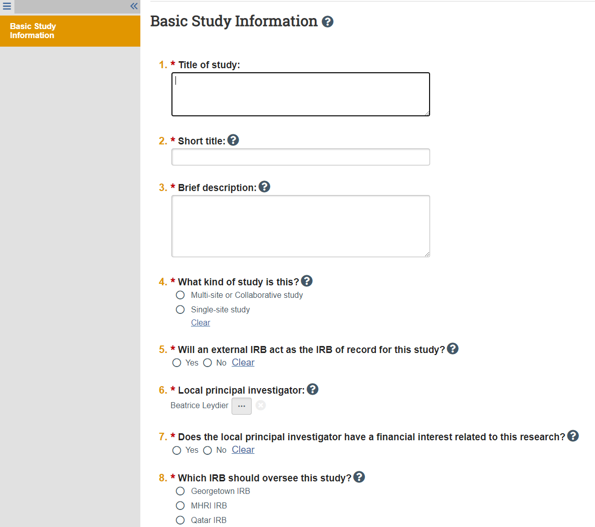
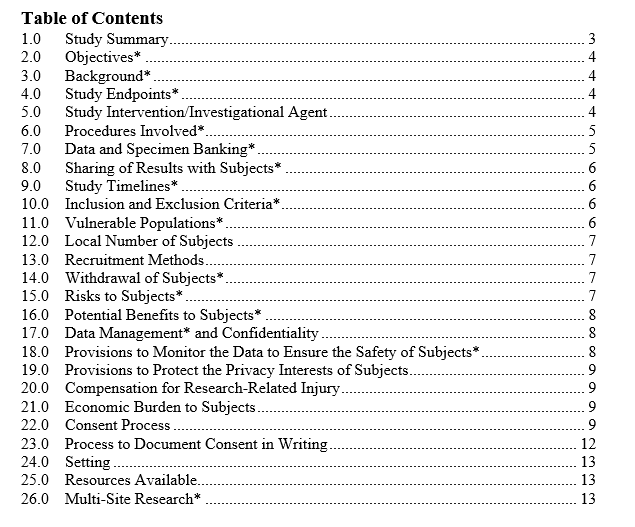

An Institutional Review Board (IRB) plays a major role to safeguard the rights and welfare of all human subjects who participate in research projects conducted by gui 2 de . In compliance with Federal law and institutional policy, all gui2de studies must be reviewed and approved by the GU IRB, in addition to other possible committees or local IRBs. gui 2 de staff and principal investigators must complete training, relating to both human research and minors, and set up a GU IRB account. The following are instructions for completing the human research training and GU IRB setup only. Please, consult with a study coordinator to determine if any additional steps must be made.

# Human Research training
1. Register and create an account at [CITI Program](http://citiprogram.org)
1. Select Georgetown University for your organization affiliation.
1. Answer the questions accordingly to your position.
1. Complete the Human Research ( Group 2. Social and behavioral research investigators and key personnel ) training.
1. When you have completed the training, submit your certificate to the Study Coordinator managing the IRB submission(s). Your certificate will be added to a shared folder in Box, and an amendment will be made to add you to the IRB submission(s).

NOTE: Training may take some time to complete; there are 16 modules, each including a quiz (3-5 questions). Please plan accordingly.

# GU IRB Account Creation
- The new GU IRB system is called [GU-Medstar](https://gumedstarirb.georgetown.edu) (The old GU electronic IRB system was called [eRIC](http://eric.georgetown.edu) and was discontinued as of May 1, 2019)
- If you already have an account with the IRB, you can sign in into the GU-Medstar portal with your GU netID and password using the "Georgetown Users" column.
    - If you haven't had an IRB account set up yet, you will need to request a new account. Fill out the form for new account available [here](https://georgetown.app.box.com/s/ig6y4xuf6oo9p4jlvphjyze4c0cmciae) and send it to irboard@georgetown.edu. They will notify you when your account is activated. NOTE: The IRB asks you to allow 7 or more business days for activation.

# GU IRB study setup
Before setting up your study in the IRB, review the IRB checklists on whether you need IRB review and what protocols your study falls under.

## Determine that you are conducting Human Research
For this, use this [HRP-310 WORKSHEET](https://gumedstarirb.georgetown.edu/IRB/sd/Doc/0/DHI7P06EI6LKT74ITVUT24G8DD/GU-HRP-310%20-%20WORKSHEET%20-%20Human%20Research%20Determination%20PRE-2018.docx)
- If you are not doing human research, you do not need to create any IRB record and the following sections are irrelevant
- All cases of human research require you to create a record in the IRB system, whether for exemption or approval

## Determine whether your research is IRB exempt
For this, use this [HRP-312 WORKSHEET](https://gumedstarirb.georgetown.edu/IRB/sd/Doc/0/CR0L78CS2SO4V1KJ8RHP1JGK01/GU-HRP-312%20-%20WORKSHEET%20-%20Exemption%20Determination%20PRE-2018.docx)
- If your research is exempt, you will need a short study description instead of the full protocol template to attach with the study. The study description should include enough details to make the case that the research is exempt. An example of an approved study description for an IRB exemption can be found [here (COVID-19 Student Survey)](https://osf.io/h3qtp/).
- If your research is not exempt, you will need to fill out the protocol template.

## Create a study record in the [GU-Medstar IRB System](https://gumedstarirb.georgetown.edu/)

  - Refer to the section above to set up your account within the system if it isn't activated yet. You should be using your GU netid for login.
  - Click on Create New Study. The screenshot below shows you what you should have prepared to create the record
      - Q2: Short title is 50 characters max and identifies the study in the IRB system
      - Q3: Brief description should be a couple sentences about the research question(s), objectives and methods
      - Q4: Multisite means multiple institutions are involved in the study design and/or implementation and/or analysis. If you select multisite, you will have to indicate whether the Georgetown IRB will also serve as IRB of record for other sites/institutions (or if they will seek their own IRB approval for their own involvement).
      - Q5: If the study is conducted with another institution whose IRB is willing to serve as IRB of record for the Georgetown teams, you can indicate it here and you will not be required to provide a protocol. You will be asked further documentation about the other IRB approval.
      - Q8: The IRB you should select is Georgetown IRB
      - Q9: You should attach the study protocol following the [HRP-503 Protocol Template](https://gumedstarirb.georgetown.edu/IRB/sd/Doc/0/LSK0TCN5PQ3K5A4I92MF64P50B/GU-HRP-503%20-%20TEMPLATE%20PROTOCOL%2011.14.18.docx).
          - The protocol is a dense, lengthy document with detailed sections below. You should plan accordingly when creating a new study record. When the study is pretty simple or straightforward, a lot of the protocol sections can be left empty by indicating N/A.
          - If you believe your study falls under an IRB exemption, you will not need to fill out the protocol template, but instead provide a study description like the one in this [example (COVID-19 Student Survey)](https://osf.io/h3qtp/).

