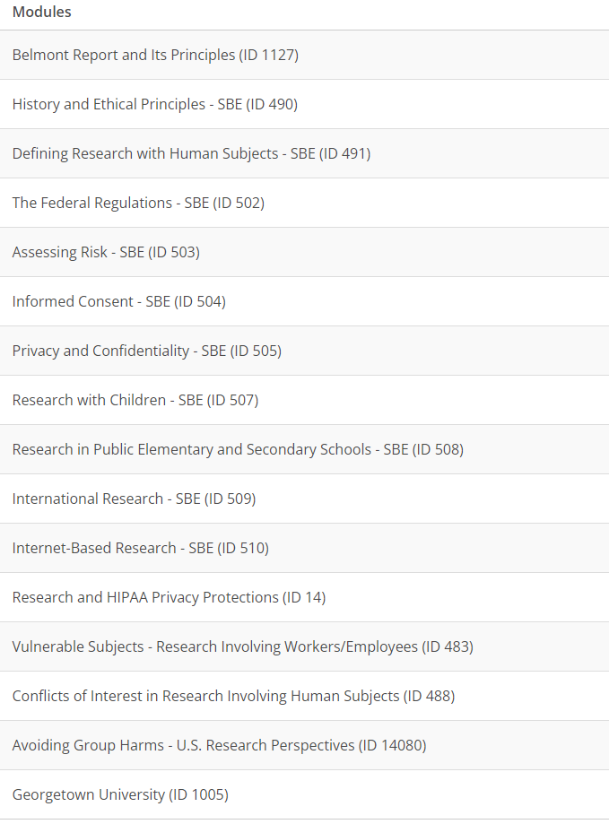

An Institutional Review Board (IRB) plays a major role to safeguard the rights and welfare of all human subjects who participate in research projects conducted by gui 2 de . In compliance with Federal law and institutional policy, all gui2de studies must be reviewed and approved by the GU IRB, in addition to other possible committees or local IRBs. gui 2 de staff and principal investigators must complete training, relating to both human research and minors, and set up a GU IRB account. The following are instructions for completing the human research training and GU IRB setup only. Please, consult with a study coordinator to determine if any additional steps must be made.

# Human Research training
1. Register and create an account at [CITI Program](http://citiprogram.org) (use the Register tab)
1. Select Georgetown University for your organization affiliation. (find Georgetown University under **Select Your Organization Affiliation**)
1. Do not select the CE course credit option (you will not need to buy course credit to pass the requirement)
1. If you have a Georgetown email address, use it; if not, use your the email address you use for your Georgetown-affiliated work.  
1. Answer the questions accordingly to your position. gui2de East Africa affiliated enumerators should select the role "Interviewer".
1. Complete the Human Research ( Group 2. Social and behavioral research investigators and key personnel ) training. Below are [more instructions](https://ora.georgetown.edu/irb/trainingrequirements/hsptraining/) on how to select the correct course:  
           - After logging in, click the "Add course or update your learner groups for Georgetown University" on the "Main Menu" page  
           - You will be directed to a page titled "Select Curriculum - Georgetown University", scroll down to question 1 and select **Group 2**  
           - Question 3 and Question 5 must be answered, however, you are not required to take these courses for the certificate, so please select "Not at this time"  
           - Scroll to the bottom of the page and click “Submit”.  You will now be able to complete the Human Subject Protection training modules.  
1. When you have completed the training, submit your certificate to the Study Coordinator managing the IRB submission(s). Your certificate will be added to a shared folder in Box, and an amendment will be made to add you to the IRB submission(s).

NOTE: Training may take some time to complete; there are 16 modules, each including a quiz (3-5 questions). Please plan accordingly. The 16 modules should look like the ones below (they may have slightly changed, but if it looks similar you are at the right place!).

# GU IRB Account Creation
- The new GU IRB system is called [GU-Medstar](https://gumedstarirb.georgetown.edu) (The old GU electronic IRB system was called [eRIC](http://eric.georgetown.edu) and was discontinued as of May 1, 2019)
    - If you already have an account with the IRB, you can sign in into the GU-Medstar portal with your GU netID and password using the "Georgetown Users" column.
    - If you haven't had an IRB account set up yet, you will need to request a new account. Fill out the form for new account available [here](https://docs.google.com/forms/d/e/1FAIpQLSdiyTHp9ASygIgpi91Ewj6YVSsvh-w1MSKEPCrcgdD-BWvVGQ/viewform). They will notify you when your account is activated. NOTE: The IRB asks you to allow 7 or more business days for activation.
