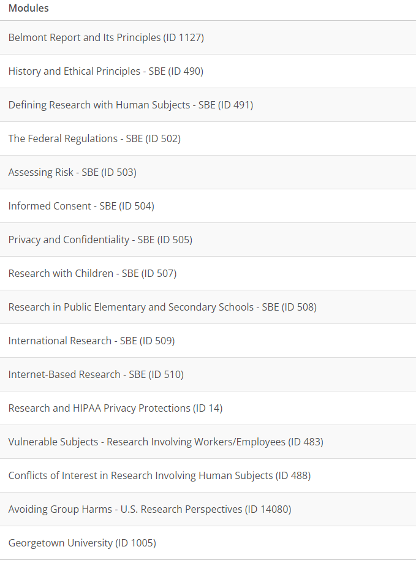

# Human Research training
1. Register and create an account at [CITI Program](http://citiprogram.org) (use the Register tab)
1. Select Georgetown University for your organization affiliation. (find Georgetown University under **Select Your Organization Affiliation**)
1. Do not select the CE course credit option (you will not need to buy course credit to pass the requirement)
1. If you have a Georgetown email address, use it; if not, use your the email address you use for your Georgetown-affiliated work.  
1. Answer the questions accordingly to your position. Enter **gui2de** for the department. gui2de East Africa enumerators should select the role "Interviewer".
1. Complete the Human Research ( Group 2. Social and behavioral research investigators and key personnel ) training. Below are [more instructions](https://ora.georgetown.edu/irb/trainingrequirements/hsptraining/) on how to select the correct course:  
           - After logging in, click the "Add course or update your learner groups for Georgetown University" on the "Main Menu" page  
           - You will be directed to a page titled "Select Curriculum - Georgetown University", scroll down to question 1 and select **Group 2**  
           - Question 3 and Question 5 must be answered, however, you are not required to take these courses for the certificate, so please select "Not at this time"  
           - Scroll to the bottom of the page and click “Submit”.  You will now be able to complete the Human Subject Protection training modules.  
1. When you have completed the training, submit your certificate to the Study Coordinator managing the IRB submission(s). Your certificate will be added to a shared folder in Box, and an amendment will be made to add you to the IRB submission(s).

NOTE: Training may take some time to complete; there are 16 modules, each including a quiz (3-5 questions). Please plan accordingly. The 16 modules should look like the ones below (they may have slightly changed, but if it looks similar you are at the right place!).

