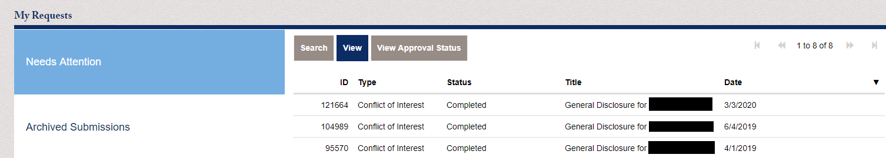

GU PASS is Georgetown University's research regulatory and compliance online system for submiting Financial Conflict of Interest Disclosures, Main Campus Internal Grant Proposals and Sabbatical Leave Requests, and External Grant Proposals.

## Financial Conflicts of Interest
Each Georgetown affiliated individual listed on the IRB of any study should have their FCOI up to date on GU PASS.

### How to submit your FCOI form in GU PASS
- Go to [https://gu-pass.georgetown.edu/](https://gu-pass.georgetown.edu/login.html)
- Log in with your GU netid and password
- Click on "Financial COI Policy Disclosure" and fill out the form
- You can find precise definitions for each term on the form on the [FCOI website](https://fcoi.georgetown.edu/appendices/appendix/)

### When to submit your FCOI form in GU pass
Every Georgetown affiliated researcher or research staff should submit a form when starting employment and
- update it once a year at least even without any significant change
- update it to signal significant changes since last disclosure

You can see your past submissions and their date by clicking "Archived Submissions" as shown below.

